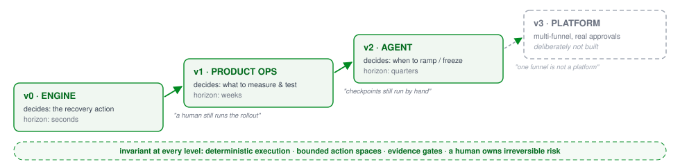
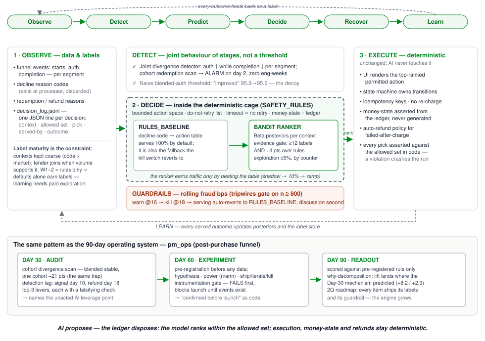
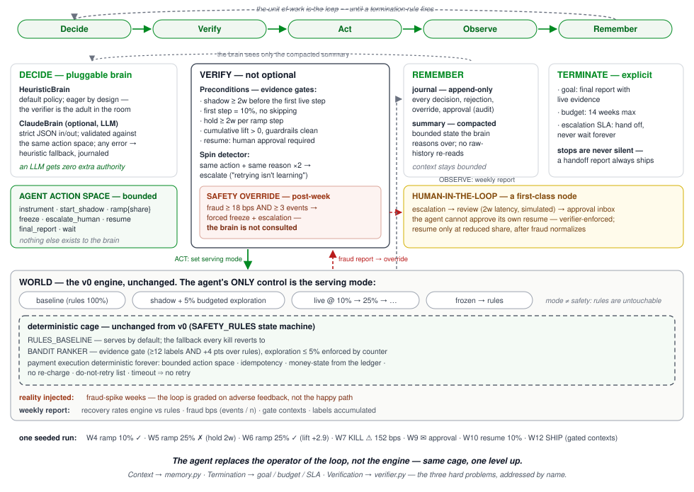

# AI Recovery Engine

[](https://github.com/markdragunov/groupon-ai-pm-case/actions/workflows/demo.yml)


> One product idea, three executable maturity levels: **fix a payment-funnel leak → run a PM's first 90 days as a system → let an agent operate the rollout loop**  with safety invariants that never move.
> Built as the working companion to a Groupon Senior AI PM case study (Checkout & Payments).

> **Disclaimer:** Personal open-source project for learning and portfolio purposes. Not affiliated with, endorsed by, or representing Groupon or any employer.

`Python 3.10+` · `zero dependencies (stdlib only)` · `seeded & fully reproducible` · `each run < 5 seconds` · `MIT`

**What this is.** An executable method, not a payments demo. The domain here is checkout recovery; the product is the decision discipline  how a senior PM introduces AI into a mission-critical system without granting it authority it has not earned.

**Why it exists.** Most AI adoption fails in one of two ways: the model gets authority before evidence, or the organization never learns because nothing is instrumented. This repo demonstrates the narrow path between the two, as running code.

**Who it is for.** Product managers and engineers who need AI inside a money path and want the adoption pattern, not the hype. Payments is the worked example; the pattern transfers to any funnel where a wrong automated decision costs money or trust.

**For reviewers** — three commands, expected outcomes:

```bash
python3 run_v0_engine.py      # → pre-committed verdict + logs/decision_log.jsonl
python3 run_v1_product_ops.py   # → reports/day60_experiment_spec.md, day90_readout.md
python3 run_v2_agent.py         # → SHIP verdict + logs/agent_journal.jsonl
```

**Contents:** [Quickstart](#quickstart) · [Maturity ladder](#the-maturity-ladder) · [Architecture](#architecture) · [How the agent operates](#how-the-agent-operates) · [The three levels](#the-three-levels-in-detail) · [Design principles](#design-principles) · [PM decision log](#the-pm-decision-log) · [Break it on purpose](#break-it-on-purpose) · [Honesty & limits](#honesty--limits)

## Quickstart

| Level | Command | What it proves |
|---|---|---|
| v0 · Engine | `python3 run_v0_engine.py` | Detection alarms on **day 2** where a blended dashboard stays green for 60 days; a rules-vs-bandit competition inside a deterministic cage; a pre-committed *ship-the-table* verdict |
| v1 · Product Ops | `python3 run_v1_product_ops.py` | The role's Day 30 / 60 / 90 plan as running code: cohort audit → pre-registered experiment behind an instrumentation gate → readout with a *why*-decomposition |
| v2 · Agent | `python3 run_v2_agent.py` | The rollout operated by an agent: bounded action space, evidence-gated ramps, a kill switch that fires **without consulting the brain**, a human approval the agent cannot forge |

Each run is seeded, needs nothing installed, finishes in seconds, and writes its artifacts to `reports/` and `logs/`.

## The maturity ladder



| Level | What decision gets automated | Horizon | The limitation that creates the next level |
|---|---|---|---|
| **v0 · Engine** | which recovery action to surface for one failed payment | seconds | the rollout itself is a hardcoded script run by a human operator |
| **v1 · Product Ops** | what to audit, measure and test — the PM's own decision process, systematized | weeks | checkpoints still execute by hand; nothing watches the loop between them |
| **v2 · Agent** | when to instrument, shadow, ramp, freeze, escalate — operating the rollout | quarters | one funnel, simulated approvals, heuristic brain by default |
| *v3 · Platform* | *multi-funnel, real approval workflow* | — | **deliberately not built** — naming the next rung without building it is the "do not grow sideways" decision, kept |

**The invariant at every level:** deterministic execution, bounded action spaces, evidence gates, and a human owning irreversible risk. Levels are **layers, not successors** — v2 contains v0 unchanged; what grows is only the scope of the decision inside the cage. (v0 / v1 / v2 denote **maturity levels**, not semver releases.)

## Architecture

**v0 — the engine.** A failed payment enters the deterministic cage: `SAFETY_RULES` defines the permitted actions for its decline context (do-not-retry list, no retry on unresolved timeouts, money-state from the ledger). Inside the cage, two competitors rank the permitted set: a rules lookup table that serves by default, and a bandit that may disagree only after clearing an evidence gate. Every outcome becomes a label; fraud tripwires auto-revert serving to rules.



**v2 — the agent.** The same cage, one level up. The agent replaces the human *operator* of the rollout — never the engine. Its only lever is the serving mode (baseline / shadow / live-at-share / frozen); safety rules are untouchable by anything that learns. A verifier gates every move, safety overrides fire regardless of the brain, and resuming after a kill requires a human approval the agent cannot forge.



## How the agent operates

The unit of work is a **weekly cycle**. One pass:

```
        ┌──────────────────────────────────────────────────────────────┐
        ▼                                                              │
 1 DECIDE     brain reads the compacted summary, proposes ONE action   │
 2 VERIFY     preconditions checked; rejection → journal + spin check  │
              → safe fallback to wait (never force the move)           │
 3 ACT        the permitted action applies; only lever = serving mode  │
 4 OBSERVE    the world runs one week; report: recovery rates,         │
              fraud bps (events/n), gate contexts, labels              │
 5 OVERRIDE   post-checks fire REGARDLESS of the brain:                │
              kill-level fraud → forced freeze + human escalation      │
 6 REMEMBER   journal (append-only) + summary compaction               │
 7 TERMINATE? goal reached / budget spent / escalation past SLA ───────┘
              (stops are never silent — a handoff report always ships)
```

### What a run produces — views, not an interface

Every run terminates into one `AgentRunResult`: the verdict, the evidence it rests on, the weekly history, and the journal events. Everything readable afterwards is a **rendering** of that object.

```
                      Agent runtime
              (decide → verify → act → observe)
                            │
                      AgentRunResult
              verdict · evidence · history · events
                            │
        ┌───────────────────┼───────────────────┐
        ▼                   ▼                   ▼
     Console            Markdown              JSONL
    narration      reports/agent_run.md  logs/agent_journal.jsonl
                                                │
                                                ▼
                                      HTML view · MCP server
                                       (named, not built)
```

The Markdown report is **not** the agent's interface — it is one view, and a deliberately thin one. The journal is the audit trail: one JSON object per decision, rejection, weekly report, safety override and human approval. A test asserts the views cannot drift from the result, so adding a renderer cannot change what the agent decided.

`HTML view · MCP server` sits here the way `v3 · Platform` sits on the maturity ladder: the seam exists and the shape is obvious, which is precisely why building it now would be growing sideways.

### The action space and its preconditions

The brain — heuristic by default, optionally an LLM — can only propose from this table. The verifier owns the right-hand column; the brain cannot negotiate it.

| Action | Precondition (verifier-enforced) |
|---|---|
| `instrument` | not yet instrumented — no telemetry, no labels |
| `start_shadow` | instrumented; mode is baseline |
| `ramp` to 10% | ≥ 2 weeks of shadow labels AND ≥ 1 context cleared the evidence gate; first step is 10%, no skipping |
| `ramp` higher | ≥ 2 weeks at current share AND cumulative lift > 0 AND guardrails clean |
| `freeze` | engine is serving |
| `escalate_human` | no escalation already open |
| `resume` | frozen AND human approval in inbox AND fraud normalized — **the agent cannot approve itself** |
| `final_report` | ≥ 10 weeks and live evidence, or budget nearly spent |
| `wait` | always available — the default when anything is uncertain |

### What the agent cannot do — by construction

It cannot touch payment execution, safety rules, or guardrail thresholds. It cannot exceed the exploration budget (counter-enforced). It cannot un-freeze itself after a kill switch. It cannot silence a stop — every termination path ships a report. An LLM brain changes none of this: `ClaudeBrain` returns strict JSON validated against the same action space and the same verifier; any error falls back to the heuristic, journaled.

### One seeded run, annotated

```text
W01  instrument                ✓   no telemetry, no labels — learning cannot start
W02  start_shadow              ✓   5% exploration begins: the budgeted price of labels
W03  wait                          labels accumulating; nothing to decide yet
W04  ramp(10%)                 ✓   evidence gate cleared in 3 contexts — live on merit
W05  ramp(25%)                 ✗   verifier: only 1w at 10% — hold 2w per step
W06  ramp(25%)                 ✓   lift +2.9 pts, guardrails clean — earned, not assumed
W07  ⚠ SAFETY OVERRIDE             fraud 152 bps (15 events / 985) → frozen + escalated
                                   — the brain was not consulted
W08  wait                          frozen; the agent cannot approve its own resume
W09  ✉ human approval arrives      review latency is part of the loop, not an exception
W10  resume(10%)               ✓   reduced share, per the approval — not back to 25%
W11  ramp(25%)                 ✗   verifier again: 1w at share — same rule, no memory of rank
W12  FINAL REPORT                  SHIP for gated contexts — lift +1.4 pts ex-incident,
                                   1 incident, full trail in logs/agent_journal.jsonl
```

Two of the rules above were found by running this repo, not by planning it: the kill switch originally fired on a single noisy fraud event (now ≥ 3 events required), and the spin detector originally confused *iteration* (same action, new rejection reason — the world moved) with *spinning* (same action, same reason). Both fixes are in [the PM decision log](#the-pm-decision-log).

## The three levels in detail

### v0 — the engine (`run_v0_engine.py`)

The signal existed on **day 2**: a naive threshold on blended auth ("improved" 95.3→95.6%) stays green for all 60 days, while the joint auth/completion divergence detector alarms on the second day of M2 — in a dataset where 7,671 authorized Intl orders die post-auth (case: 7,650). Detection is an analyst artifact, zero eng-weeks.

Then the honest competition. The ground truth is deliberately built so the lookup table is right for **most** contexts; value for learning exists only in *interaction pockets* — the same decline code with a different best action per market (`do_not_honor × ES` recovers better with `retry_later` than `switch_tender`). In six simulated weeks the ranker finds **one of three** pockets and leaves two at "needs more labels". That is the realistic result and the point: **label maturity is the binding constraint** — which is why contexts are deliberately coarse (code × market), and why the console prints the confirmatory sample size (~9,000/arm for a +2 pt read) instead of declaring victory at n=464.

| Case claim | Where it is enforced |
|---|---|
| Execution stays deterministic; AI only ranks a bounded action space | `SAFETY_RULES` in [engine/decide.py](engine/decide.py); every served action is asserted against the allowed set — a violation crashes the run |
| SCA soft declines are a first-class recovery (EU) | `soft_decline_3ds → step_up_3ds` carries the highest base odds |
| Rules first; the model is an option, not a bet | `RULES_BASELINE` serves by default; the greedy pick **is** the rules pick unless a challenger clears the gate (≥12 labels AND +4 pts) |
| Exploration is budgeted, not free | Thompson sampling capped at 5%, enforced by a **counter, not a coin flip** |
| Tripwires never fire on noise | 16 bps warn / 18 bps kill, gated on n≥800 **and ≥3 events**; on breach, serving auto-reverts to rules |
| "If the model never beats the table, ship the table" | the verdict in [run_v0_engine.py](run_v0_engine.py) is a pre-committed rule |

### v1 — Product Ops: the first 90 days, executable (`run_v1_product_ops.py`)

The same pattern, transferred to the post-purchase funnel and mapped 1:1 to the role's success criteria:

| Success criterion | What the tool produces |
|---|---|
| **Day 30** — funnel audited; top-3 levers; the unacted AI leverage point named | Blended funnel looks stable while the cohort scan finds one cohort collapsed −21 pts (the same blended-metric trap, one funnel to the right). Detection-lag measured: refund arrives day ~18, non-redemption telemetry knew by day 10 — ~70% of non-redeemers never ask, they churn silently. The unacted leverage point: **everything between day 10 and day 18** |
| **Day 60** — experiment live, instrumentation confirmed BEFORE launch | Pre-registered *Redemption Rescue v1*: power (base 22%, MDE 5 pts → n/arm, ~2 weeks), guardrails, ship/iterate/kill written before data. The instrumentation gate **fails on first run** and blocks launch until closed → `reports/day60_experiment_spec.md` |
| **Day 90** — results in; you know *why* either way; 2-quarter roadmap | Readout scored against pre-registered thresholds only. "Knowing why" = decomposition: lift concentrates in the broken cohort (+8 pts, p<0.001), ~flat elsewhere → `reports/day90_readout.md` |

### v2 — the agentic loop (`run_v2_agent.py`)

v0 executed a hardcoded six-week script; v2 deletes the script. The three hard problems of agent loops, addressed by name: **context management** ([agent/memory.py](agent/memory.py) — append-only journal for audit, compacted summary for reasoning), **termination** (goal · budget · escalation SLA — explicit, never silent), **verification** ([agent/verifier.py](agent/verifier.py) — evidence-gated preconditions, post-week overrides, spin detection). Optional LLM decide-step: `python3 run_v2_agent.py --brain claude` (needs `ANTHROPIC_API_KEY`).

## Design principles

| Principle | Where it is enforced |
|---|---|
| AI never receives authority automatically | `RULES_BASELINE` serves by default; the model must beat it to earn traffic |
| Rules outperform AI until AI proves otherwise | the pre-committed *ship-the-table* verdict |
| Every recommendation is evidence-based | evidence gates at both levels: the bandit's (labels + margin) and the agent's (weeks + lift + clean guardrails) |
| Human approval is explicit | resume-after-kill requires an approval the agent cannot forge — verifier-enforced |
| A verifier protects the system | preconditions, safety overrides, spin detection in [agent/verifier.py](agent/verifier.py) |
| Learning is continuous | every served outcome becomes a label at every level |
| Everything is observable | one JSON line per decision: `logs/decision_log.jsonl`, `logs/agent_journal.jsonl` |
| Everything is explainable | posteriors, allowed sets, rejection reasons and required sample sizes are printed, not implied |

## The PM decision log

| Decision | Alternative rejected | Why |
|---|---|---|
| Rules serve by default; model must beat them | model-first with rules fallback | the table captures most value; the model is funded by the measured delta, not by the word "AI" |
| Contexts coarse: code × market | code × market × tender × amount | label maturity is the binding constraint; cells must fill in weeks, not quarters |
| Exploration cap enforced by counter | probabilistic 5% coin flip | a budget that can be exceeded by luck is not a budget |
| Kill switch needs ≥3 events, not just bps | bps threshold alone | a tripwire that fires on one noisy event is noise, not safety *(found by running this repo)* |
| Spin = same action + same *reason* twice | same action twice | a rejection for a new reason means the world moved — iteration, not spinning *(also found by running)* |
| Agent controls serving mode only | agent adjusts safety rules / thresholds | mode ≠ safety; rules are untouchable by anything that learns |
| Resume after kill requires human approval | agent self-resumes when metrics normalize | irreversible-risk decisions never self-authorize |
| Experiment pre-registration before data | decide thresholds at readout | Day 90 must be a lookup, not a negotiation with reality |
| v3 named but not built | grow the platform now | scope discipline is a product decision; the empty rung on the ladder is deliberate |

## Break it on purpose

The tunables are the product decisions — change one, rerun, and watch the system answer:

| Change | Where | What you will see | The product lesson |
|---|---|---|---|
| `explore_budget=0.0` | [engine/simulate.py](engine/simulate.py) | the ranker never finds a single pocket | you cannot learn what you never try; exploration is the tuition |
| `MARGIN = 0.10` | [engine/decide.py](engine/decide.py) | the gate never clears; verdict flips to **SHIP THE TABLE** | raising the burden of proof is a one-line policy, not a meeting |
| delete `INTERACTIONS` | [engine/simulate.py](engine/simulate.py) | the honest world where the table is simply right | "ship the table" is a designed outcome, not a failure mode |
| move `FRAUD_SPIKE` to week 5 | [agent/world.py](agent/world.py) | the kill fires at 10% share instead of 25% | the loop's behaviour under adversity is testable, not anecdotal |

## Repository map

- [run_v0_engine.py](run_v0_engine.py) · [run_v1_product_ops.py](run_v1_product_ops.py) · [run_v2_agent.py](run_v2_agent.py) — one entry point per maturity level
- [engine/](engine/) — data · detect · decide (cage, baseline, ranker, guardrails) · simulate
- [pm_ops/](pm_ops/) — data · audit · experiment · readout
- [agent/](agent/) — world · memory · verifier · brain · loop (`AgentRunResult` + Markdown renderer)
- [tests/](tests/) — seeded smoke checks: pre-committed verdicts and view/result consistency
- [docs/](docs/) — architecture.svg (v0) · architecture_v2.svg (v2) · maturity_ladder.svg
- `reports/`, `logs/`, `data/` — generated on run

## Honesty & limits

All data is **synthetic and seeded**; the funnel break, the interaction pockets and the fraud spike are *planted* so the mechanisms can be demonstrated end-to-end. This repo proves **method, not findings** the first real run belongs on real telemetry and its week-one job is to falsify the planted assumptions. Known limits, stated rather than hidden one funnel; simulated human review; a heuristic brain by default; offline evaluation of counterfactuals is only exact here because the simulator is omniscient in production that is precisely what the exploration budget pays for.

**On synthetic data:**

1. Synthetic data is not a shortcut — it is an explicit design choice.
2. The simulator exists to validate decision-making, not to validate business outcomes.
3. Every pattern in the simulator is intentionally planted.
4. The first production deployment is expected to falsify those assumptions.
5. If production behaves exactly like the simulator, the simulator was probably unrealistic.

## Contributing

See [CONTRIBUTING.md](CONTRIBUTING.md). Security reports: [SECURITY.md](SECURITY.md). Release history: [CHANGELOG.md](CHANGELOG.md).

License: [MIT](LICENSE).
